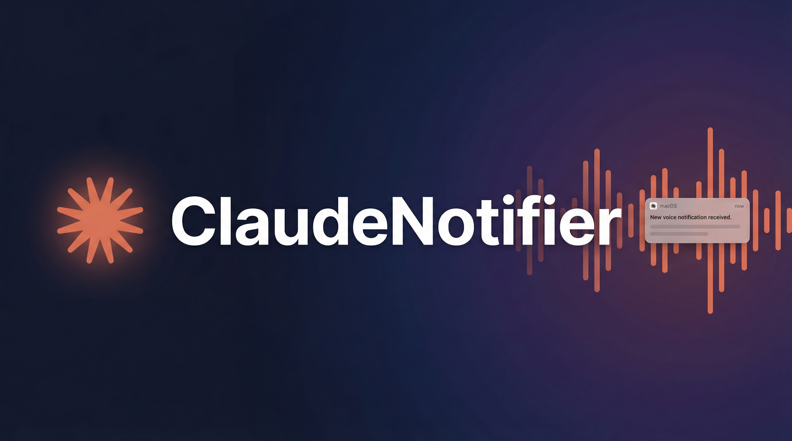

<p align="center">
  
</p>

<p align="center">
  <a href="claude-notifier-macos/"></a>
  <a href="claude-notifier-windows/"></a>
  <a href="LICENSE"></a>
</p>

<p align="center">
  <b>跨平台桌面通知工具，当 Claude Code 完成任务时发送通知 + 语音提醒</b>
</p>

---

## 解决什么问题？

**场景**：你同时开了多个 Claude Code 终端窗口，让 AI 并行处理不同任务。

**痛点**：任务完成后你不知道，继续等待或去做别的事，等回来发现 AI 早就完成了——白白浪费了宝贵的 AI 使用时间。

**方案**：通过 Claude Code Hooks，在任务完成时自动发送桌面通知 + 语音提醒（如「搞定咯~」），即使你在其他窗口工作也能立刻知道。

<p align="center">
  
  <br/>
  <i>macOS 原生通知效果（带 Claude 图标 + 语音提醒）</i>
</p>

## 平台支持

| 平台        | 目录                                                   | 语言  | 状态      |
| ----------- | ------------------------------------------------------ | ----- | --------- |
| **macOS**   | [`claude-notifier-macos/`](claude-notifier-macos/)     | Swift | ✅ 稳定   |
| **Windows** | [`claude-notifier-windows/`](claude-notifier-windows/) | Rust  | 🚧 开发中 |

## 快速开始

### macOS

```bash
git clone https://github.com/zengwenliang416/claude-notifier.git
cd claude-notifier/claude-notifier-macos
make install
```

详细文档：[macOS 版 README](claude-notifier-macos/README.md)

### Windows

```powershell
# 下载 Release 或从源码构建
cd claude-notifier-windows
cargo build --release

# 首次运行（必需）
.\target\release\claude-notifier.exe --init
```

详细文档：[Windows 版 README](claude-notifier-windows/README.md)

## Claude Code Hooks 配置

推荐使用 TypeScript Hook 统一管理通知（桌面 + 远程并行执行）：

```json
{
  "hooks": {
    "Stop": [
      {
        "matcher": "",
        "hooks": [
          {
            "type": "command",
            "command": "npx tsx ~/.claude/hooks/stop-check.ts"
          }
        ]
      }
    ]
  }
}
```

Hook 功能：

- 检查 TodoList 是否全部完成（未完成则阻止结束）
- 发送桌面通知（ClaudeNotifier.app）
- 发送远程推送（ntfy/Telegram/Bark，只启用一个）
- 桌面和远程通知并行执行，不阻塞
- **显示项目名称**：通知会显示当前项目名（如「pay 项目任务已完成」），方便多项目并行时区分
- **点击跳转**：点击通知自动跳转到对应项目窗口（支持 Zed/VS Code/Cursor 等）
- **任务状态**：支持成功/失败/警告状态区分（`--status`）
- **摘要信息**：支持副标题和耗时显示（`--subtitle`、`--duration`）
- **历史记录**：所有通知自动记录到 JSONL 文件

### 仅桌面通知（简化版）

如果只需要桌面通知，可直接调用：

**macOS**:

```json
{
  "hooks": {
    "Stop": [
      {
        "matcher": "",
        "hooks": [
          {
            "type": "command",
            "command": "/Applications/ClaudeNotifier.app/Contents/MacOS/ClaudeNotifier -t 'Claude Code' -m 'Claude 已完成回答'"
          }
        ]
      }
    ]
  }
}
```

**带状态和摘要的完整示例**：

```bash
# Hook 脚本中可以根据任务结果动态设置参数
/Applications/ClaudeNotifier.app/Contents/MacOS/ClaudeNotifier \
  -t "Claude Code" \
  -m "重构完成" \
  --status success \
  --subtitle "修改了 5 个文件" \
  --duration 180
```

**Windows**:

```json
{
  "hooks": {
    "Stop": [
      {
        "matcher": "",
        "hooks": [
          {
            "type": "command",
            "command": "%USERPROFILE%\\.claude\\apps\\claude-notifier.exe -t \"Claude Code\" -m \"Claude 已完成回答\""
          }
        ]
      }
    ]
  }
}
```

## 项目结构

```
claude-notifier/
├── README.md                    # 本文档（项目总览）
├── LICENSE                      # MIT 许可证
├── .github/workflows/           # GitHub Actions CI
├── images/                      # 文档图片（共用）
├── examples/                    # Hook 示例脚本（共用）
├── sounds/                      # 音效文件目录（共用）
├── claude-notifier-macos/       # macOS 版本
│   ├── README.md
│   ├── Makefile
│   ├── src/
│   │   └── ClaudeNotifier.swift
│   └── resources/
│       ├── Info.plist
│       └── AppIcon.icns
└── claude-notifier-windows/     # Windows 版本
    ├── README.md
    ├── Cargo.toml
    ├── build.rs
    ├── src/
    │   ├── main.rs
    │   ├── cli.rs
    │   ├── toast.rs
    │   ├── sound.rs
    │   └── registration.rs
    ├── resources/
    └── scripts/
        └── install.ps1
```

## 多渠道推送

除了桌面通知，还支持推送到手机和 IM 工具（**只能启用一个远程渠道**）：

| 渠道     | 平台        | 状态      |
| -------- | ----------- | --------- |
| ntfy.sh  | iOS/Android | ✅ 已测试 |
| Telegram | 全平台      | ✅ 已测试 |
| Bark     | iOS         | ✅ 已测试 |
| 飞书     | 企业        | 🔧 待测试 |
| 钉钉     | 企业        | 🔧 待测试 |
| 企业微信 | 企业        | 🔧 待测试 |

### 架构说明

- **桌面通知**：调用 ClaudeNotifier.app（Swift/Rust 原生实现）
- **远程推送**：TypeScript Hook 内置实现（无需 shell 脚本）
- **执行方式**：桌面通知与远程推送**并行执行**
- **渠道互斥**：远程推送只启用一个渠道（ntfy > Telegram > Bark 优先级）

### 快速配置

在 `~/.claude/settings.json` 的 `env` 字段中配置环境变量：

```json
{
  "env": {
    "CLAUDE_NOTIFY_CHANNEL": "bark",
    "BARK_KEY": "your-device-key",
    "TELEGRAM_BOT_TOKEN": "your-bot-token",
    "TELEGRAM_CHAT_ID": "your-chat-id",
    "NTFY_TOPIC": "your-topic"
  }
}
```

**配置说明**：

| 环境变量                | 说明                               | 必需                 |
| ----------------------- | ---------------------------------- | -------------------- |
| `CLAUDE_NOTIFY_CHANNEL` | 推送渠道：`bark`/`telegram`/`ntfy` | 是（选择其一）       |
| `BARK_KEY`              | Bark 设备密钥                      | 使用 Bark 时必需     |
| `TELEGRAM_BOT_TOKEN`    | Telegram Bot Token                 | 使用 Telegram 时必需 |
| `TELEGRAM_CHAT_ID`      | Telegram Chat ID                   | 使用 Telegram 时必需 |
| `NTFY_TOPIC`            | ntfy 主题名                        | 使用 ntfy 时必需     |

> **重要**：必须在 `settings.json` 中配置，而非 `~/.zshrc`。因为 Claude Code Hooks 不加载 shell 环境变量。

## 高级功能

### 任务状态区分

通过 `--status` 参数区分任务结果，失败时使用不同的视觉和声音提示：

```bash
# 成功（默认）
ClaudeNotifier -t "Claude Code" -m "任务完成"

# 失败（标题前缀 ❌，使用 Basso 警告音）
ClaudeNotifier -t "Claude Code" -m "构建失败" --status failure

# 警告（标题前缀 ⚠️）
ClaudeNotifier -t "Claude Code" -m "有 3 个警告" --status warning
```

### 通知摘要增强

使用 `--subtitle` 和 `--duration` 参数提供更丰富的通知信息：

```bash
# 带副标题和耗时
ClaudeNotifier -t "Claude Code" -m "重构完成" \
  --subtitle "修改了 5 个文件" \
  --duration 120  # 自动格式化为 "2m"
```

### 结构化历史记录

所有通知自动记录到 `~/.claude/notifier-history.jsonl`（JSONL 格式）：

```bash
# 查看最近 5 条记录
tail -5 ~/.claude/notifier-history.jsonl | jq .

# 查询失败的任务
cat ~/.claude/notifier-history.jsonl | jq 'select(.status == "failure")'

# 统计今日通知数
cat ~/.claude/notifier-history.jsonl | jq -s '[.[] | select(.timestamp | startswith("2025-01-01"))] | length'
```

**记录字段**：

| 字段        | 说明                          |
| ----------- | ----------------------------- |
| `timestamp` | ISO8601 时间戳                |
| `pid`       | 进程 ID                       |
| `title`     | 通知标题                      |
| `message`   | 通知内容                      |
| `project`   | 项目路径（如有）              |
| `status`    | 状态：success/failure/warning |
| `subtitle`  | 副标题（如有）                |
| `duration`  | 耗时秒数（如有）              |

## 技术对比

| 特性     | macOS                    | Windows                  |
| -------- | ------------------------ | ------------------------ |
| 语言     | Swift                    | Rust                     |
| 通知 API | UNUserNotificationCenter | ToastNotificationManager |
| 图标机制 | App Bundle (.icns)       | AUMID + 快捷方式 (.lnk)  |
| 音频格式 | .aiff, .wav, .caf        | 仅 .wav                  |
| 首次运行 | 自动授权弹窗             | 需手动 `--init`          |
| 点击跳转 | ✅ 支持（AX API + CLI）  | 🔧 开发中                |
| 任务状态 | ✅ 支持                  | 🔧 开发中                |
| 历史记录 | ✅ JSONL                 | 🔧 开发中                |

## 自定义语音音效

### macOS

```bash
# 使用 TTS 生成
say -v Tingting "搞定咯~" -o ~/.claude/sounds/done.aiff
```

### Windows

```powershell
# 使用 PowerShell TTS
Add-Type -AssemblyName System.Speech
$synth = New-Object System.Speech.Synthesis.SpeechSynthesizer
$synth.SetOutputToWaveFile("$env:USERPROFILE\.claude\sounds\done.wav")
$synth.Speak("搞定咯")
$synth.Dispose()
```

## License

MIT License
